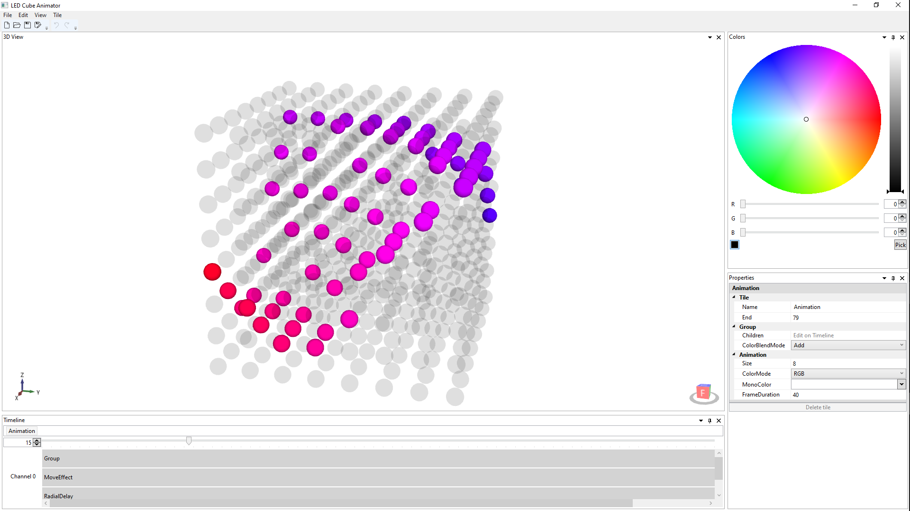

# LED Cube Animator

Desktop app for creating animations for LED cubes (volumetric LED displays).

## Description

An LED cube is a display consisting of discrete LEDs arranged in a 3D grid. Each LED is a voxel (3D pixel) that can be
controlled individually. By driving them in specific patterns, one can create simple animations or lighting effects.
This program aims to help with this task.

The animation is built out of blocks called "tiles". Tiles can be arranged on the timeline and composed together to
create complex visual effects, without explicitly defining each animation timestep voxel-by-voxel. Some tiles are
standalone, others modify effects of tiles above it. At each timestep, the pattern shown by the LED cube
(color/brightness of each voxel) depends on all tiles active at that timestep. The animation can be exported to a binary
file that contains voxel data for each timestep, so that it can be easily read and displayed by the LED cube controller.

## Compilation

Visual Studio 2019 or newer is required to build this project. Simply open the solution file and choose Build > Build
Solution. Required NuGet packages should be restored automatically.

## Usage

This is a WPF app, so it's recommended to run it on Windows. However, it also works on Linux with Wine.

### User Interface

The user interface consists of a menu bar and four panes:

- 3D View - provides a preview of the LED cube at a given timestep
- Timeline - presents tiles chronologically, has a slider to change currently previewed timestep
- Colors - allows selecting a color in order to edit Frame tiles
- Properties - allows changing properties of tiles

The File menu provides the usual operations for saving and opening animation files, as well as exporting binary files.
Animation files use the JSON format, and they are saved with `.3da` extension by default.

The program supports basic editing operations such as copy-paste and undo-redo, accessible from the Edit menu and
through keyboard shortcuts. Multiple tiles can be selected by holding `Ctrl`. Tiles can be repositioned on the timeline
by dragging and resizing them using the left mouse button (or editing the relevant properties).

New tiles can be added through the Tile menu. They will appear on the timeline where they can be selected to edit their
properties. The horizontal position of a tile defines the timesteps in which it is active. The vertical position defines
the order in which tile effects are applied, from top to bottom (i.e. a given tile modifies the output from the tile
above it). Additionally, the timeline can have multiple channels, indicated by separator lines and labels on the
left-hand side. Tiles in different channels are independent of one another and the outputs from each channel are
combined at the end, according to the ColorBlendMode property.

The 3D View shows the LED cube at a timestep selected by the timeline slider or the box next to it. When this box is
focused, you can hold the up/down arrow key to scroll through timesteps at a consistent pace.

### Tile Types

This section describes the available types of tiles and their properties. Tile types are categorized hierarchically,
according to the properties they have in common. For example, a GradientEffect has all properties of Tile, Effect, and
GradientEffect. Sample animations demonstrating the common use cases for different tile types are provided in the
[Examples](Examples) folder.

**Tile** - base tile that can be placed on the timeline.
- Name - custom name for easier identification
- Start - first timestep when the tile is active
- End - last timestep when the tile is active
- Channel - which channel the tile belongs to
- Hierarchy - order in which effects from tiles in a given channel are applied

1. **Frame** - static image defined voxel-by-voxel. The voxels can be edited by selecting a desired color/brightness in
the Colors pane and clicking on the chosen voxels in the 3D View (if Animation ColorMode is MonoBrightness or RGB). If
ColorMode is Mono, clicking a voxel will toggle its on/off state. Note that the preview always shows the final output
after all effects at the current timestep have been applied, which can modify how the Frame looks. Hence, it is
recommended to add Frame tiles first and then add any other effects to make voxel editing less confusing.
    - Voxels - voxel pattern stored at this frame, should be edited in the 3D View
    - Offset - offset of the pattern within the cube
    - Size - size of the pattern (same as cube size by default)

2. **Effect** - dynamic effect whose output changes in time. Behavior depends on the effect subtype.
    - TimeInterpolation - how the effect quantity should be interpolated in time
    - RepeatCount - how many times to repeat the effect
    - Reverse - whether the effect should only be played forward (unchecked) or forward and then reversed (checked)

    1. **Group** - special effect that can have other tiles as children. Essentially, a Group acts like a nested
    animation, and it has its own timeline. This provides an easy way to repeat or change time interpolation for
    multiple effects at once, by wrapping them inside a group. To see the nested timeline, the Children property should
    be selected. To go back to the parent timeline, the relevant Animation/Group should be selected in the panel above
    the timeline slider. This panel shows all ancestors of the current group (groups can be nested recursively).
        - Children - nested tiles inside the group, should be selected to see nested timeline
        - ColorBlendMode - how to combine outputs from different channels

        1. **Animation** - specialized group that acts as the root. It includes settings affecting the whole animation.
        Some tile properties (Start, Channel, Hierarchy) are not editable, and the End property specifies animation
        length.
            - Size - LED cube size
            - ColorMode - LED cube type, either Mono (on/off), MonoBrightness (only brightness control), or RGB
            - MonoColor - LED cube color if ColorMode is Mono or MonoBrightness (only affects the preview)
            - FrameDuration - duration of a timestep (in milliseconds)

    2. **GradientEffect** - effect that interpolates between two colors in time (all voxels will have the same color at
    a particular timestep). To interpolate between colors in space instead of time, add a Delay tile (with Static
    property enabled) below the GradientEffect.
        - From - initial color
        - To - final color
        - ColorInterpolation - color space to interpolate in (use HSV to interpolate between hues for best result)

    3. **TransformEffect** - effect that takes the output from the tile above it (within the same channel) and applies a
    matrix transformation to it. The kind of transformation depends on the subtype. The transformation quantity is
    interpolated in time between values defined by From and To properties. Note that if From and To values are the same,
    the transformation quantity doesn't change in time.
        - From - initial value
        - To - final value
        - Round - whether to round fractional voxel coordinates to whole numbers

        1. **MoveEffect** - applies translation matrix.
            - Axis - direction of translation

        2. **RotateEffect** - applies rotation matrix.
            - Axis - which axis to rotate around
            - Center - center of rotation (on a plane orthogonal to Axis)

        3. **ScaleEffect** - applies scaling matrix.
            - Axis - which axis to scale along
            - Center - center of scaling (point along Axis)

        4. **ShearEffect** - applies shearing matrix.
            - Plane - pair of axes that define shearing direction
            - Center - center of shearing (point along first axis of Plane)

3. **Delay** - tile that changes the apparent timestep for the tiles above it, depending on voxel location. This has the
effect as if some voxels were "lagging behind" by some amount of time based on their location. The dependence between
voxel location and lag amount depends on the subtype.
    - Value - amount of lag per one unit of difference in location (can be positive or negative)
    - WrapAround - whether to wrap around the apparent timestep if it falls beyond this tile's timestep bounds
    - Static - if enabled, the apparent timestep for a given location is frozen for the whole duration of this tile

    1. **LinearDelay** - amount of lag depends on location along a line.
        - Axis - chosen line
        - Center - point along Axis where the lag is zero

    2. **RadialDelay** - amount of lag depends on distance from a line.
        - Axis - direction of chosen line
        - Center - point where the lag is zero (on a plane orthogonal to Axis)

    3. **SphericalDelay** - amount of lag depends on the distance from the center point.
        - Center - center point where the lag is zero

    4. **AngularDelay** - amount of lag depends on the angle, as if a plane was being rotated around a line.
        - Axis - direction of chosen line
        - Center - center of rotation (on a plane orthogonal to Axis)
        - StartAngle - angle where the lag is zero

### Exporting

Once the animation is completed, it can be exported to a binary file (with custom `.3db` extension). To do this, choose
File > Export > Binary file (.3db). The file format is very simplistic, so that it can be parsed by LED cube controllers
which are often based on microcontrollers with limited computing power. The downside is a large file size, so external
storage (e.g. SD card) is usually required. See [Exporter.cs](LedCubeAnimator/Model/Animations/Exporter.cs) for details
about the file format.

## Project Status

The program is functional but a bit rough around the edges and several features are missing. It isn't being actively
developed at the moment (apart from bugfixes), but I may come back to it at some point in the future. Here is an
indicative list of possible future features:

- C library for reading output files on LED cube controllers (e.g. Arduino)
- Output file compression
- Playback controls
- Hierarchical presentation of nested groups and tiles (tree view)
- Easier editing for flat frames (2D view)
- More tile types
- Manipulators for editing tile properties in 3D View
- More realistic rendering
- Update to a recent .NET version
- Better documentation and tutorial

## Libraries

This project makes use of the following libraries:

- [Helix Toolkit](https://github.com/helix-toolkit/helix-toolkit)
([MIT license](https://github.com/helix-toolkit/helix-toolkit/blob/develop/LICENSE))
- [AvalonDock](https://github.com/Dirkster99/AvalonDock)
([Microsoft Public License](https://github.com/Dirkster99/AvalonDock/blob/master/LICENSE))
- [WpfExtendedToolkit](https://github.com/dotnetprojects/WpfExtendedToolkit)
([Microsoft Public License](https://github.com/dotnetprojects/WpfExtendedToolkit/blob/Extended/LICENSE.md))
- [MVVM Light Toolkit](https://github.com/lbugnion/mvvmlight)
([MIT license](https://github.com/lbugnion/mvvmlight/blob/master/LICENSE))
- [MVVM Dialogs](https://github.com/FantasticFiasco/mvvm-dialogs)
([Apache-2.0 license](https://github.com/FantasticFiasco/mvvm-dialogs/blob/master/LICENSE))
- [PropertyTools](https://github.com/PropertyTools/PropertyTools/)
([MIT license](https://github.com/PropertyTools/PropertyTools/blob/develop/LICENSE))
- [Gu.Wpf.Geometry](https://github.com/GuOrg/Gu.Wpf.Geometry)
([MIT license](https://github.com/GuOrg/Gu.Wpf.Geometry/blob/master/LICENSE))
- [Json.NET](https://github.com/JamesNK/Newtonsoft.Json)
([MIT license](https://github.com/JamesNK/Newtonsoft.Json/blob/master/LICENSE.md))
- [CommonServiceLocator](https://github.com/unitycontainer/commonservicelocator)
([Microsoft Public License](https://github.com/unitycontainer/commonservicelocator/blob/master/LICENSE))
- [Visual Studio Code Icons](https://github.com/microsoft/vscode-icons)
([CC-BY-4.0 license](https://github.com/microsoft/vscode-icons/blob/main/LICENSE))

## License

This project is released under the [GPLv3 license](LICENSE), with additional permissions listed below:

Additional permission under GNU GPL version 3 section 7

If you modify this Program, or any covered work, by linking or combining it with AvalonDock (or a modified version of
that library), containing parts covered by the terms of Microsoft Public License, the licensors of this Program grant
you additional permission to convey the resulting work. Corresponding Source for a non-source form of such a combination
shall include the source code for the parts of AvalonDock used as well as that of the covered work.

Additional permission under GNU GPL version 3 section 7

If you modify this Program, or any covered work, by linking or combining it with WpfExtendedToolkit (or a modified
version of that library), containing parts covered by the terms of Microsoft Public License, the licensors of this
Program grant you additional permission to convey the resulting work. Corresponding Source for a non-source form of such
a combination shall include the source code for the parts of WpfExtendedToolkit used as well as that of the covered
work.

Additional permission under GNU GPL version 3 section 7

If you modify this Program, or any covered work, by linking or combining it with CommonServiceLocator (or a modified
version of that library), containing parts covered by the terms of Microsoft Public License, the licensors of this
Program grant you additional permission to convey the resulting work. Corresponding Source for a non-source form of such
a combination shall include the source code for the parts of CommonServiceLocator used as well as that of the covered
work.
